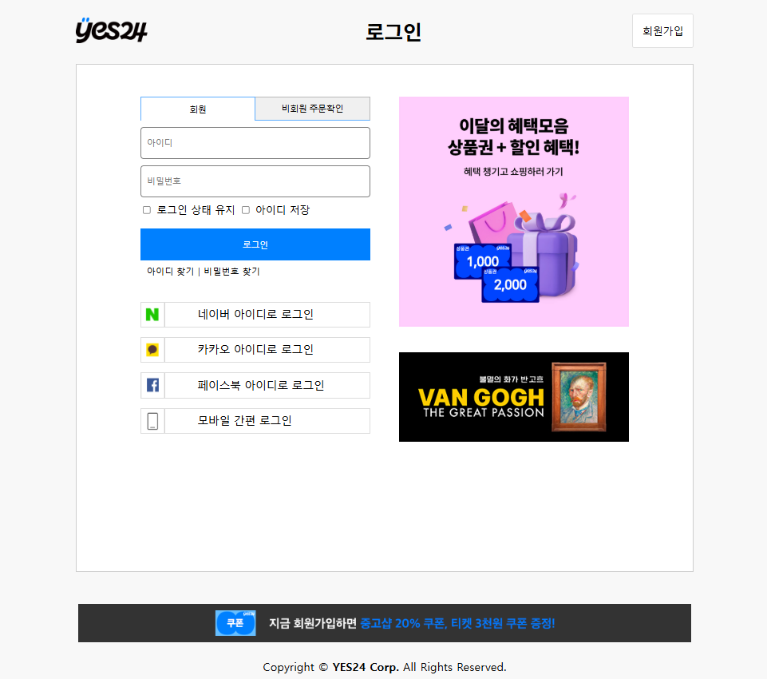
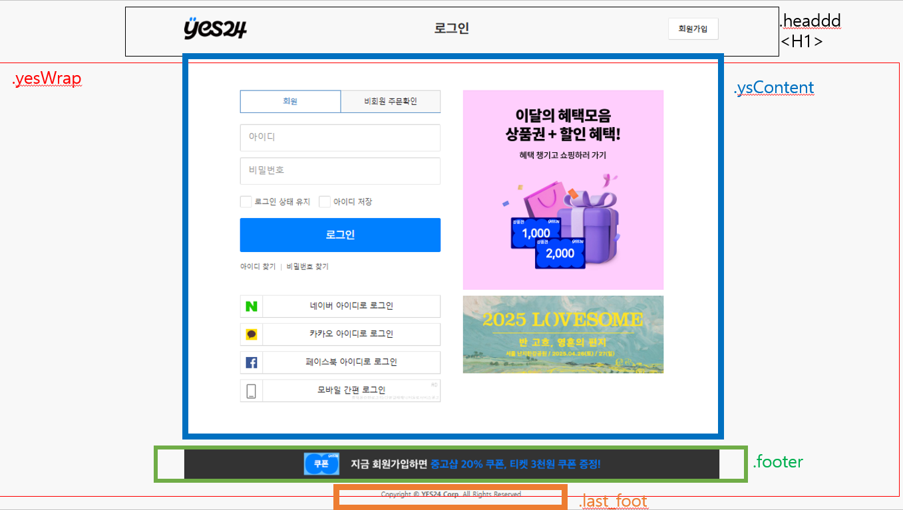
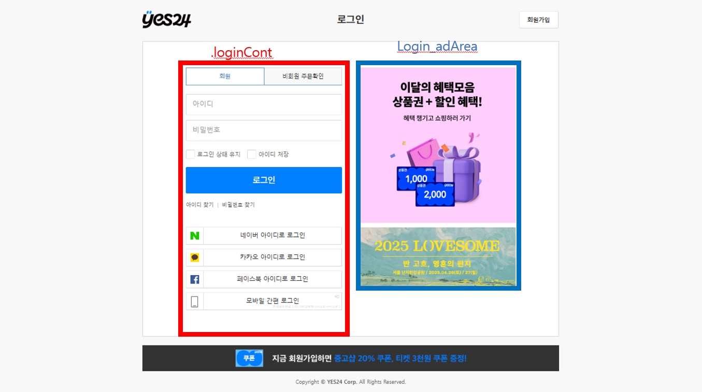
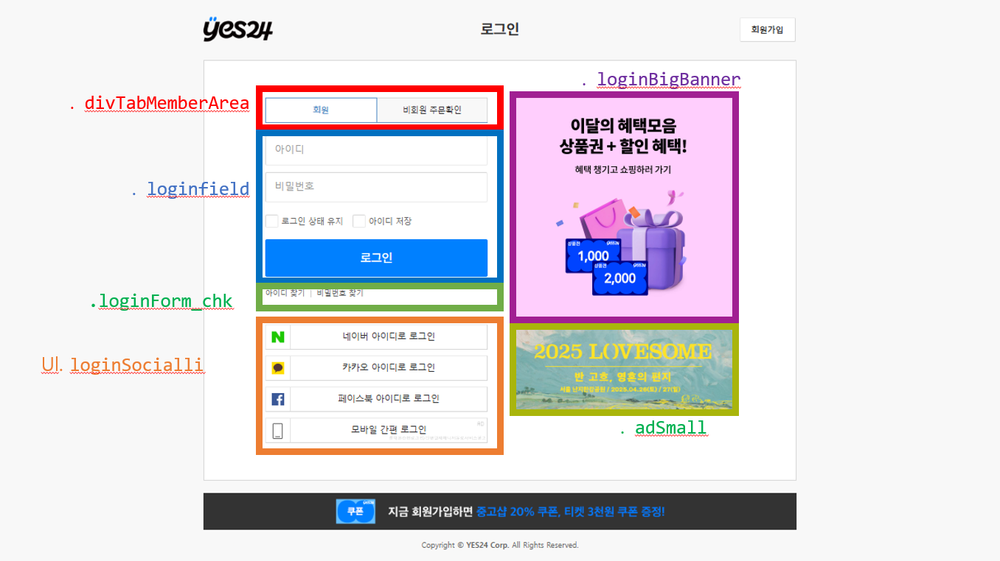

# yes24 로그인창 클론코딩 프로젝트

이 프로젝트는 **yes24** 웹사이트를 클론 코딩한 결과물입니다.  
html, css, javascript를 사용하여 구현하였으며, 프론트엔드 개발 역량을 키우기 위해 제작하였습니다.

## 🔹 프로젝트 개요
- **프로젝트명**: yes24 로그인창 
- **개발 기간**: 2025.03.20 ~ 2025.03.25  
- **주요 기술**: HTML, CSS, JavaScript

## 🔹 주요 기능
1. 기존의 UI 구성 및 스타일링 클론코딩
2. javascript 기반 기능 구현
- 로그인 및 비회원 주문확인 창 전환
- 로그인 상태 유지 체크박스 기능
- 버튼 클릭 시 스타일 변경
- 로그인 입력 유효성 검사 (경고 메시지 출력)
- 비회원 주문확인 입력 유효성 검사 (경고 메시지 출력)

## 🔹 프로젝트 이미지  
  
**figure. 1.** 메인 페이지 UI

### 🔹 화면 구성 기획
 
**figure. 2.** 본 화면의 header-main-footer

 
**figure. 3.** main의 세부 구성 (1)

**figure. 4.** main의 세부 구성 (2)

---
## 🔹 개선 가능성 및 회고
- 코드 구조 최적화 및 성능 개선 시도
- 이미지 최적화
- vue.js로 전환

## 🔹 Contact
- GitHub: [GitHub](https://github.com/ShonJuSeong)
- Email: sow7722@gmail.com
